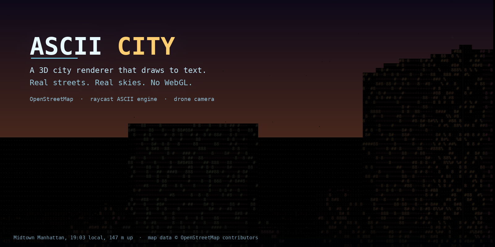
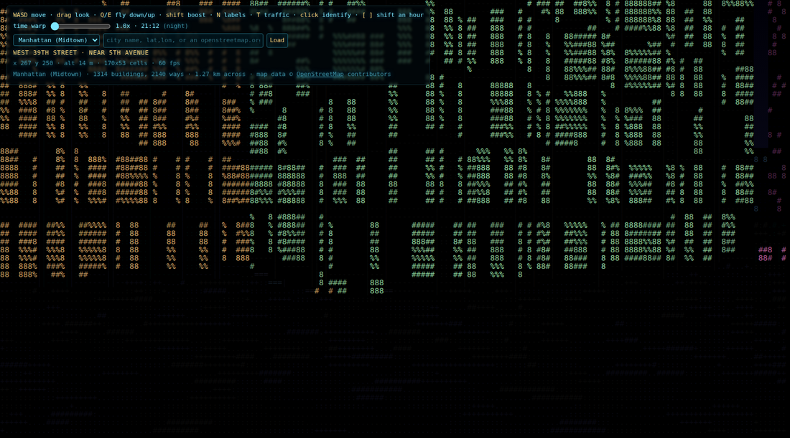
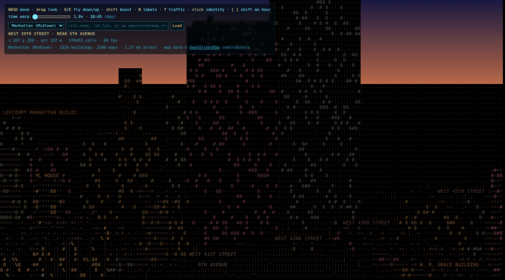
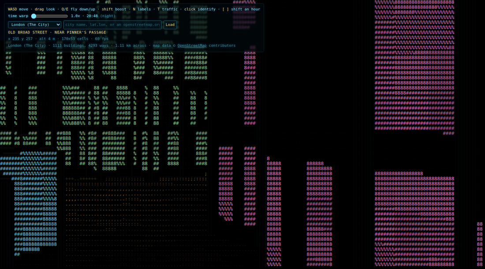
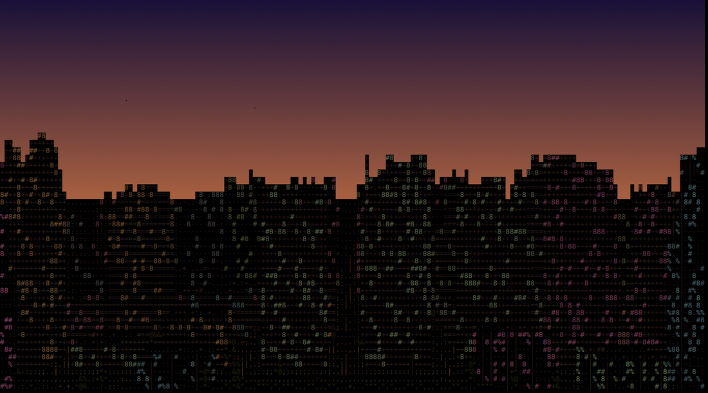

# ASCII City

A 3D city renderer that draws to text. No WebGL, no shaders, no dependencies:
just a raycaster writing coloured characters into a grid, blitted to a 2D canvas.

Point it at any coordinates on Earth and it pulls the real building footprints,
street network, rivers and parks from OpenStreetMap, then lets you walk the
streets or fly a drone camera over the rooftops.

The sky is not decoration. Sun and star positions are computed from real
astronomy (Julian day, solar right ascension and declination, local sidereal
time) for the latitude and longitude you are standing at, so sunset in Tokyo
happens at Tokyo's sunset.

## Running it

```bash
git clone https://github.com/tweakyourpc/ascii-city.git
cd ascii-city
python3 -m http.server 8000     # or: npx serve .
```

Then open <http://localhost:8000>.

A static server is required: the engine is built from ES modules, and browsers
refuse to load modules over `file://`. The pre-refactor single-file version in
`legacy/ascii-city.html` has no such requirement and opens directly.

## Controls

| Key | Action |
| --- | --- |
| `W` `A` `S` `D` | Move |
| Drag mouse | Look around |
| `E` / `Q` | Fly up / down |
| `Shift` | Boost, on the ground and in the air |
| Arrow keys | Move and turn |
| `N` | Cycle labels: off / streets / streets and landmarks |
| `B` | Toggle half-block rendering |
| `T` | Cycle traffic: off / cars / cars and people |
| Click | Identify a building, a street or a star |
| `Esc` | Close the panel |
| `[` `]` | Scrub back / forward one hour |
| Time warp slider | Speed the clock up to 10000x |

Fly above a building and you can land on its roof and walk around up there.

## Knowing where you are

Point it at a real city and it reads the OpenStreetMap tags that come with the
map data: street names, building names, heights, addresses, construction dates.

- The HUD always names the street you are on and the nearest crossing.
- Named streets label themselves whenever they are in view, one label per
  street, depth-tested so buildings occlude them. A name is written **along**
  its street as it appears on screen: down the screen for a street heading
  away from you, across for one crossing your view, swapping as you turn. At a
  junction that is the difference between knowing which name belongs to which
  street and guessing.
- Notable buildings, meaning named and either tall or carrying a Wikipedia
  link, name themselves as you approach.
- Click anything. A building gives its name, type, real height and floor
  count, address, year built and distance, plus a Wikipedia summary for the
  roughly one building in nine that has one. The ground gives the street, or a
  named cafe, shop or subway entrance if you clicked near one. The sky gives
  the star, planet or the Moon, with its phase.

In one square kilometre of Midtown Manhattan that is 296 named buildings, 148
with Wikipedia articles, 987 street addresses and 184 named main arteries,
none of which costs an extra request: it was already in the map data and being
thrown away.

`N` turns the whole layer off when it gets in the way.

## Loading a city

Pick a preset from the dropdown, or type into the box:

- `Kyoto`: a place name, resolved through OpenStreetMap's geocoder
- `40.7580,-73.9855`: a point, and a box is built around it
- `40.74,-74.00,40.76,-73.98`: an explicit `south,west,north,east` box
- `https://www.openstreetmap.org/#map=16/51.5074/-0.1278`: a map link

A place name resolves to the middle of that place. A geocoder's own bounding
box for a city is the whole city, some thousands of times more than this will
load, so only the centre is used. The name it actually matched is shown, since
"Springfield" is ambiguous and quietly loading the wrong one would be worse
than saying so.

The URL hash tracks where you are, so any view is a shareable link:

```
#city=manhattan&x=267&y=250&z=58&a=2.10&p=11&h=18.75
      city      position   altitude  angle  pitch  hour
```

`#hud=0` hides the overlay, for clean screenshots.

Areas are capped at roughly 2 km a side. Overpass is a free, volunteer-run
service, and a request for a whole country is how you get blocked from it.

## Gallery

| | |
| --- | --- |
|  <br> **Midtown Manhattan, street level, 21:12.** 1314 real building footprints. |  <br> **The same block at 137 m.** Rooftops, parapets, and red aircraft beacons on anything over 60 m. |
|  <br> **The City of London at night.** The medieval street plan, not a grid. |  <br> **The procedural city at dusk.** Infinite, generated from a hash function, and the offline fallback. |

## How it works

**Rendering.** A per-column DDA raycast against a height field draws building
facades, and a floor cast fills every row below the horizon with ground. Output
is a character grid with a parallel colour grid, blitted as run-length batched
`fillText` calls, so a full screen costs a few hundred draws rather than tens
of thousands.

**Roofs, and why they matter.** The camera flies, which means it can be above
the geometry. A roof at height `h` turns out to be a floor cast at elevation
`h`, so the same row-to-distance inversion serves both, and one code path
covers standing in the street and hovering over the skyline. Without the roof
pass there is also an analytic gap between one cell's facade and the next
cell's base, which shows up as hairline slits of distant ground along the near
edge of every rooftop.

**Occlusion.** A single bottom-anchored watermark per column is provably
sufficient here: for a height field seen from outside, base rows decrease
monotonically with distance, so nothing behind can ever appear below something
in front, and DDA cells are contiguous so spans always overlap.

**The horizon does not move with altitude.** On a flat world it sits at eye
level however high you are; only its distance changes. What sells altitude is
rooftops becoming visible and the ground flattening into a map.

**Two rendering modes.** `B` switches between one character per cell and
half-blocks, which run the grid at double vertical resolution and paint the
scene as solid colour. Blocks are sharper and much more vivid, because a glyph
only inks part of its cell and silently dims everything it draws. Glyphs carry
information blocks cannot: road markings, water, foliage, lit windows. Blocks
do about 2.1x the canvas draw calls and are still ~13% faster to blit, because
`fillRect` is much cheaper than `fillText`.

**Transparency.** Foliage is see-through, which the original occlusion scheme
could not express: a single bottom-anchored watermark per column is only
correct for opaque spans. Coverage is now a per-column bitmask, with a fast
path that keeps an all-opaque frame bit-identical and free.

**Worlds.** The renderer never learns whether it is drawing a procedural city
or Manhattan. Both implement one interface that returns an integer slot into
chunked struct-of-arrays, so nothing allocates in a function called twelve
thousand times per frame.

## Tools

```bash
npm test                                  # 158 tests, no network
node tools/render-frame.js --z 60 --pitch 15    # render a frame as text
node tools/map-preview.js --city london         # top-down map of an import
```

`tools/render-frame.js` prints a frame to stdout. The engine's output is
characters, so it can be inspected, diffed and regression-tested without a
browser. `tools/map-preview.js` prints a rasterized world top-down, which is
how an OSM import gets checked against the real street layout.

## Accuracy

Worth stating what has actually been verified rather than assumed:

- London's tallest building comes out at 278 m. That is 22 Bishopsgate.
- Manhattan's street grid renders at its true ~29° rotation off north, with
  Bryant Park in the right place.
- The refactored procedural generator is pinned against the original engine's
  by a test over 42k cells: identical type, height, palette, lamp falloff and
  road markings.
- The planets and Moon are checked against physics rather than a stored
  ephemeris. Mercury's greatest elongation comes out at 27.8 degrees against a
  true maximum of 28, Venus at 47.2 against 45 to 47, lunar perigee and apogee
  at 356,686 and 406,254 km against 356,500 and 406,700, and the mean synodic
  month at 29.5266 days against 29.53059.

Buildings with no height data are rendered as 3 levels, per OpenStreetMap
convention. Beyond the loaded extract the ground is drawn as neutral haze
rather than invented countryside.

## Ideas worth doing

- **[Live flight tracking](docs/FLIGHT-TRACKING.md)**: plot real aircraft
  taking off and landing. The data is excellent and the engine already has the
  pieces, but no free flight API allows a browser to call it directly, so it
  needs a proxy of some kind. The document measures the options and sketches a
  provider interface so a data source can be plugged in as an add-on. Help
  welcome.

## Licence

Code: [MIT](LICENSE) © Christopher Davis.

Map data: © [OpenStreetMap](https://www.openstreetmap.org/copyright)
contributors, available under the Open Database Licence.
